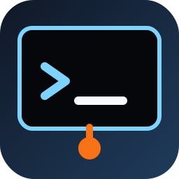

#  Codex GUI

[](https://github.com/meinzeug/codex-gui/releases/tag/v0.1.0)


**Codex GUI** turns Codex CLI into a desktop-native workstation.

It embeds the real `codex` terminal inside a GTK interface, layers fast prompt entry and live dictation on top, and keeps the raw CLI output fully visible. The result feels like a focused operator console rather than a wrapper.

## Why This Exists

Codex CLI is powerful, but long sessions benefit from a better control surface:

- A persistent visible terminal instead of context-switching between windows
- One-click desktop launchers for normal mode and self-healing supermode
- Live voice input that streams work back into the same Codex session
- Screenshot-to-prompt attachment without leaving the flow
- Resume-aware restarts for long-running project work

This project is opinionated on purpose: native Linux desktop, minimal ceremony, maximal momentum.

## Highlights

- **Real embedded terminal** via GTK3 + VTE, not a fake console widget
- **Direct prompt injection** into a live Codex CLI process
- **Live dictation loop** with automatic send after 1.5 seconds of silence
- **Voice commands** for `enter` and `shotscreen`
- **Screenshot attachment** into Codex using local image references
- **Resume mode** backed by detected Codex session metadata
- **Supermode watchdog** that keeps the GUI alive while you use the tool to work on itself
- **Desktop integration** with setup automation, GNOME launchers, and dock favorites

## Demo Workflow

1. Launch `Codex GUI` or `Codex GUI Supermode`
2. Speak or type your prompt
3. Watch the real Codex output in the embedded terminal
4. Say `enter` when you want to submit explicitly
5. Say `shotscreen` to attach the current screen to the conversation
6. Keep iterating without leaving the same visible session

## Quick Start

### 1. Clone the repository

```bash
git clone https://github.com/meinzeug/codex-gui.git
cd codex-gui
```

### 2. Run setup

```bash
./setup.sh
```

`setup.sh` installs the required Ubuntu/GNOME packages, installs local Python dependencies into `.python-deps`, creates desktop launchers, and pins both launchers into GNOME favorites.

### 3. Start the app

```bash
./start.sh
```

### 4. Start supermode

```bash
./start_supermode.sh
```

## Components

- [codex_terminal_gui.py](./codex_terminal_gui.py): main GTK application with embedded VTE terminal, voice pipeline, screenshot handling, and resume logic
- [codex_gui_supermode.py](./codex_gui_supermode.py): supervisor that restarts the GUI when it exits
- [setup.sh](./setup.sh): dependency bootstrap and GNOME integration
- [start.sh](./start.sh): parameterless normal launcher
- [start_supermode.sh](./start_supermode.sh): parameterless supermode launcher

## Voice Control

The app supports an always-listening mode built for short iteration loops.

- Spoken text is transcribed and transferred into the live Codex terminal
- After 1.5 seconds of silence, the current chunk is sent automatically
- Saying `enter` emits a real terminal enter
- Saying `shotscreen` captures the current screen and attaches it to Codex

The default speech backend installs `SpeechRecognition` locally. You can also provide a custom transcription backend through `CODEX_GUI_TRANSCRIBE_CMD`.

## Supermode

Supermode exists for a very specific use case: using **Codex GUI to develop Codex GUI**.

When the main app is launched through the supervisor, the GUI becomes a child process. If it exits, restarts, or crashes during self-editing, the supervisor brings it back. That makes the tool resilient while it is actively rewriting itself.

## Requirements

- Linux desktop session
- Python 3
- GTK3 / PyGObject
- VTE
- Codex CLI installed and authenticated
- GNOME desktop recommended for the best launcher and screenshot workflow

## Roadmap

- Better session visualization
- Cleaner screenshot capture across Wayland variants
- Packaged release artifacts
- Optional model/session controls in the header bar

## Release 0.1.0

Release `0.1.0` establishes the core product:

- Embedded Codex CLI GUI
- Voice-driven workflow
- Screenshot injection
- Resume-aware restarts
- Supermode for self-hosted editing
- Desktop launchers and setup automation

See [CHANGELOG.md](./CHANGELOG.md) for the release notes.

## License

[MIT](./LICENSE)
